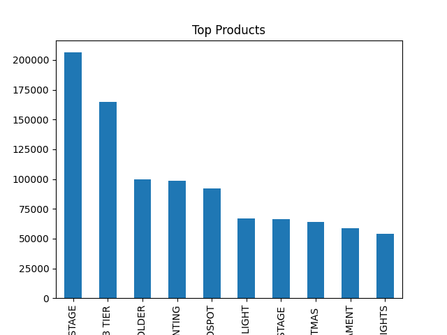
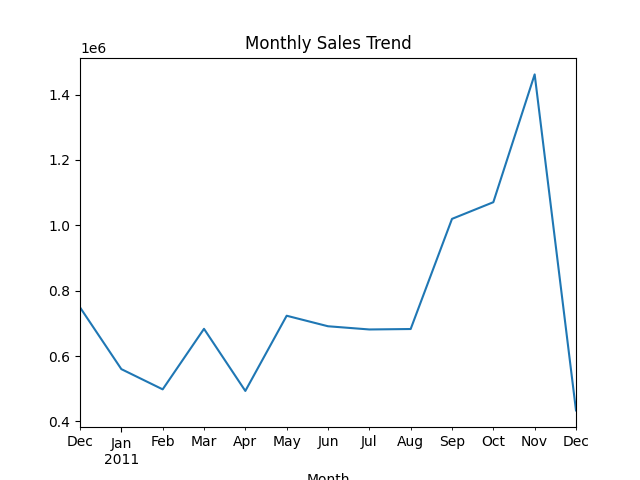
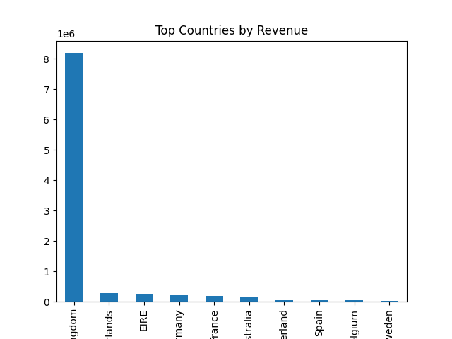

Here is your **final complete README in ONE block** — just copy and paste directly into GitHub ✅

---

```markdown
# 📊 Sales Data Analysis Project

This project was completed as part of a Data Science Internship. It focuses on analyzing an online retail dataset to extract meaningful insights related to sales performance, customer behavior, and product trends.

---

## 📌 Project Objective

The main goals of this project are:
- To identify top-performing products based on revenue  
- To analyze sales trends over time  
- To evaluate country-wise sales performance  
- To generate actionable business insights  

---

## 🗂 Dataset Information

The dataset contains transactional data of an online retail store, including:
- Invoice Number  
- Product Description  
- Quantity  
- Invoice Date  
- Unit Price  
- Customer ID  
- Country  

📎 Dataset Source:  
https://www.kaggle.com/datasets/luisrenterialezano/retail-sales-dataset

---

## 🧹 Data Preprocessing

The following data cleaning steps were performed:
- Removed missing values from key columns  
- Filtered out negative quantities (returns/cancellations)  
- Converted `InvoiceDate` to datetime format  
- Created a new feature:  
  **Revenue = Quantity × Unit Price**

---

## 📈 Key Performance Indicators (KPIs)

- **Total Revenue:** 8,911,407.90  
- **Top Product:** WHITE HANGING HEART T-LIGHT HOLDER  
- **Top Country:** United Kingdom  

---

## 📊 Data Visualization

### 🔝 Top 10 Products by Revenue


---

### 📅 Monthly Sales Trend


---

### 🌍 Revenue by Country


---

## 💡 Key Insights

- The United Kingdom contributes the highest share of total revenue  
- A small number of products generate a large portion of overall sales  
- Sales trends show fluctuations across months, indicating seasonal patterns  
- High-performing products should be prioritized in inventory planning  
- Underperforming regions can be targeted with improved marketing strategies  

---

## 📁 Project Structure

```

Sales_Analysis.ipynb
Report.pdf
top_products.png
monthly_sales.png
countries.png
README.md

```

---

## 🛠 Tools & Technologies Used

- Python  
- Pandas  
- NumPy  
- Matplotlib  
- Seaborn  
- Jupyter Notebook  

---

## 📌 Conclusion

This project demonstrates how data analysis techniques can be used to uncover valuable insights from raw data. The findings can help businesses make informed decisions to improve revenue and operational efficiency.

---

## 🙏 Acknowledgment

This project was completed as part of a Data Science Internship at Syntecxhub.
```

---

# ✅ DONE

Just:

1. Paste this into `README.md`
2. Upload your graph images
3. Click **Commit**

---

If you want, I can quickly:
✔ Check your GitHub repo
✔ Help you submit final form
✔ Improve LinkedIn post

Just send 👍
